# 📡 Documentation de l'API

## Table des Matières

- [Vue d'ensemble](#vue-densemble)
- [Authentification](#authentification)
- [Services](#services)
- [Endpoints](#endpoints)
- [Schémas de Données](#schémas-de-données)
- [Codes d'Erreur](#codes-derreur)
- [Exemples d'Utilisation](#exemples-dutilisation)

---

## Vue d'ensemble

L'API Gateway est le point d'entrée unique pour tous les services. Elle route les requêtes vers les services appropriés.

### Base URL

```
http://localhost:8004
```

### Performance & Timeouts

> [!IMPORTANT]
> Les requêtes d'inférence (Deep Learning) peuvent être lourdes. L'API Gateway est configurée avec un **timeout de 60 secondes**. Si votre modèle ou votre matériel est lent, assurez-vous que votre client HTTP respecte ce délai.

### Format des Réponses

Toutes les réponses sont au format JSON.

### Serveurs

| Service | URL Interne | Port | Description |
|---------|-------------|------|-------------|
| API Gateway | `http://api-gateway:8000` | 8004 | Point d'entrée |
| Auth Service | `http://auth-service:8000` | 8000 | Authentification |
| Inference Service | `http://inference-service:8001` | 8001 | Prédictions |
| Data Service | `http://data-service:8002` | 8002 | CRUD Données |

---

## Authentification

L'API utilise **JWT (JSON Web Tokens)** pour l'authentification.

### Flow d'Authentification

```mermaid
sequenceDiagram
    participant C as Client
    participant A as API Gateway
    participant Auth as Auth Service
    
    C->>A: POST /api/auth/register
    A->>Auth: Créer utilisateur
    Auth-->>A: Utilisateur créé
    A-->>C: 200 OK
    
    C->>A: POST /api/auth/login
    A->>Auth: Vérifier credentials
    Auth-->>A: JWT Token
    A-->>C: access_token
    
    C->>A: Request avec Token
    A->>Auth: Vérifier Token
    Auth-->>A: Token valide
    A-->>C: Response
```



### Obtenir un Token

1. **Inscription** : `POST /api/auth/register`
2. **Connexion** : `POST /api/auth/login`
3. **Utiliser le token** : Incluez-le dans les headers (si nécessaire)

---

## Endpoints

### 🔐 Authentification

#### `POST /api/auth/register`

Créer un nouveau compte utilisateur.

**Request Body:**
```json
{
  "email": "user@example.com",
  "password": "securePassword123"
}
```

**Response 200:**
```json
{
  "id": 1,
  "email": "user@example.com",
  "created_at": "2024-01-15T10:30:00.000Z"
}
```

**Response 400:**
```json
{
  "detail": "Email already registered"
}
```

---

#### `POST /api/auth/login`

Se connecter et obtenir un token JWT.

**Request Body:**
```json
{
  "email": "user@example.com",
  "password": "securePassword123"
}
```

**Response 200:**
```json
{
  "access_token": "eyJhbGciOiJIUzI1NiIsInR5cCI6IkpXVCJ9.eyJzdWIiOiJ1c2VyQGV4YW1wbGUuY29tIiwiZXhwIjoxNjQyMjU1ODAwfQ.signature",
  "token_type": "bearer"
}
```

**Response 401:**
```json
{
  "detail": "Invalid credentials"
}
```

---

#### `GET /api/auth/verify`

Vérifier la validité d'un token JWT.

**Query Parameters:**
- `token` (string, required): Le token JWT à vérifier

**Response 200:**
```json
{
  "valid": true,
  "email": "user@example.com"
}
```

**Response 401:**
```json
{
  "detail": "Invalid or expired token"
}
```

---

### 🧠 Inférence (Prédictions)

#### `POST /api/inference/predict`

Analyser une image et obtenir une prédiction.

**Request:**
- Type: `multipart/form-data`
- Champs:
  - `file` (file, required): Image mammographique (JPG, JPEG, PNG)

**Exemple avec cURL:**
```bash
curl -X POST "http://localhost:8004/api/inference/predict" \
  -F "file=@/path/to/image.jpg"
```

**Response 200:**
```json
{
  "prediction": "Negative",
  "confidence": 0.8734
}
```

**Valeurs de `prediction`:**
- `"Positive"`: Cancer détecté
- `"Negative"`: Pas de cancer

**Valeurs de `confidence`:**
- Float entre 0.0 et 1.0
- Plus proche de 1.0 = plus confiant

**Response 500:**
```json
{
  "detail": "Error processing image: Invalid image format"
}
```

---

### 🔄 Workflow Complet

#### `POST /api/workflow/predict-and-save`

Workflow complet : Prédiction + Sauvegarde dans la base de données.

**Request:**
- Type: `multipart/form-data`
- Champs:
  - `file` (file, required): Image mammographique

**Exemple avec cURL:**
```bash
curl -X POST "http://localhost:8004/api/workflow/predict-and-save" \
  -F "file=@mammogram.jpg"
```

**Response 200:**
```json
{
  "prediction": {
    "prediction": "Negative",
    "confidence": 0.8734
  },
  "saved_record": {
    "id": 42,
    "prediction": "Negative",
    "confidence": 0.8734,
    "filename": "mammogram.jpg",
    "created_at": "2024-01-15T10:30:00.000Z"
  }
}
```

---

### 💾 Gestion des Données (CRUD)

#### `POST /api/predictions`

Créer une nouvelle entrée de prédiction.

**Request Body:**
```json
{
  "prediction": "Negative",
  "confidence": 0.8734,
  "filename": "scan1.jpg"
}
```

**Response 200:**
```json
{
  "id": 1,
  "prediction": "Negative",
  "confidence": 0.8734,
  "filename": "scan1.jpg",
  "created_at": "2024-01-15T10:30:00.000Z"
}
```

---

#### `GET /api/predictions`

Récupérer la liste des prédictions.

**Query Parameters:**
- `skip` (integer, optional): Nombre d'éléments à sauter (default: 0)
- `limit` (integer, optional): Nombre maximum de résultats (default: 100)

**Exemple:**
```bash
curl "http://localhost:8004/api/predictions?skip=0&limit=10"
```

**Response 200:**
```json
[
  {
    "id": 1,
    "prediction": "Positive",
    "confidence": 0.92,
    "filename": "scan1.jpg",
    "created_at": "2024-01-15T10:30:00.000Z"
  },
  {
    "id": 2,
    "prediction": "Negative",
    "confidence": 0.87,
    "filename": "scan2.jpg",
    "created_at": "2024-01-15T11:15:00.000Z"
  }
]
```

---

#### `GET /api/predictions/{prediction_id}`

Récupérer une prédiction spécifique par ID.

**Path Parameters:**
- `prediction_id` (integer, required): ID de la prédiction

**Exemple:**
```bash
curl "http://localhost:8004/api/predictions/1"
```

**Response 200:**
```json
{
  "id": 1,
  "prediction": "Positive",
  "confidence": 0.92,
  "filename": "scan1.jpg",
  "created_at": "2024-01-15T10:30:00.000Z"
}
```

**Response 404:**
```json
{
  "detail": "Prediction not found"
}
```

---

#### `PUT /api/predictions/{prediction_id}`

Mettre à jour une prédiction existante.

**Path Parameters:**
- `prediction_id` (integer, required): ID de la prédiction

**Request Body:**
```json
{
  "prediction": "Negative",
  "confidence": 0.85,
  "filename": "updated_scan.jpg"
}
```

**Response 200:**
```json
{
  "id": 1,
  "prediction": "Negative",
  "confidence": 0.85,
  "filename": "updated_scan.jpg",
  "created_at": "2024-01-15T10:30:00.000Z"
}
```

---

#### `DELETE /api/predictions/{prediction_id}`

Supprimer une prédiction.

**Path Parameters:**
- `prediction_id` (integer, required): ID de la prédiction

**Response 200:**
```json
{
  "message": "Prediction deleted successfully"
}
```

**Response 404:**
```json
{
  "detail": "Prediction not found"
}
```

---

### 📊 Statistiques

#### `GET /api/predictions/stats/summary`

Obtenir un résumé statistique global.

**Response 200:**
```json
{
  "total": 150,
  "positive": 45,
  "negative": 105,
  "positive_percentage": 30.0
}
```

**Champs:**
- `total`: Nombre total de prédictions
- `positive`: Nombre de résultats positifs (cancer détecté)
- `negative`: Nombre de résultats négatifs
- `positive_percentage`: Pourcentage de résultats positifs

---

### 🏥 Health Checks

#### `GET /health`

Vérifier l'état de l'API Gateway.

**Response 200:**
```json
{
  "status": "API Gateway is running"
}
```

**Autres services:**
- `http://localhost:8000/health` - Auth Service
- `http://localhost:8001/` - Inference Service
- `http://localhost:8002/health` - Data Service

---

## Schémas de Données

### User

```typescript
{
  id: integer,           // ID unique
  email: string,         // Email unique
  hashed_password: string, // Mot de passe haché
  created_at: datetime   // Date de création
}
```

### Prediction

```typescript
{
  id: integer,           // ID unique
  prediction: string,    // "Positive" ou "Negative"
  confidence: float,     // Score de confiance (0.0-1.0)
  filename: string,      // Nom du fichier analysé
  created_at: datetime   // Date de création
}
```

### JWT Token Payload

```typescript
{
  sub: string,          // Subject (email)
  exp: integer          // Expiration timestamp
}
```

---

## Codes d'Erreur

| Code | Signification | Description |
|------|---------------|-------------|
| 200 | OK | Requête réussie |
| 201 | Created | Ressource créée avec succès |
| 400 | Bad Request | Paramètres invalides |
| 401 | Unauthorized | Token invalide ou expiré |
| 404 | Not Found | Ressource non trouvée |
| 500 | Internal Server Error | Erreur serveur |

### Format d'Erreur Standard

```json
{
  "detail": "Description de l'erreur"
}
```

---

## Exemples d'Utilisation

### Python avec `requests`

```python
import requests

# Base URL
BASE_URL = "http://localhost:8004"

# 1. Inscription
register_data = {
    "email": "doctor@hospital.com",
    "password": "SecurePass123"
}
response = requests.post(f"{BASE_URL}/api/auth/register", json=register_data)
print(response.json())

# 2. Connexion
login_data = {
    "email": "doctor@hospital.com",
    "password": "SecurePass123"
}
response = requests.post(f"{BASE_URL}/api/auth/login", json=login_data)
token = response.json()["access_token"]
print(f"Token: {token}")

# 3. Prédiction
with open("mammogram.jpg", "rb") as f:
    files = {"file": f}
    response = requests.post(
        f"{BASE_URL}/api/workflow/predict-and-save",
        files=files
    )
    print(response.json())

# 4. Récupérer les statistiques
response = requests.get(f"{BASE_URL}/api/predictions/stats/summary")
print(response.json())

# 5. Récupérer l'historique
response = requests.get(f"{BASE_URL}/api/predictions?limit=10")
predictions = response.json()
for pred in predictions:
    print(f"{pred['filename']}: {pred['prediction']} ({pred['confidence']:.2%})")
```

---

### JavaScript avec `fetch`

```javascript
const BASE_URL = "http://localhost:8004";

// 1. Inscription
async function register() {
  const response = await fetch(`${BASE_URL}/api/auth/register`, {
    method: "POST",
    headers: {
      "Content-Type": "application/json"
    },
    body: JSON.stringify({
      email: "doctor@hospital.com",
      password: "SecurePass123"
    })
  });
  const data = await response.json();
  console.log(data);
}

// 2. Connexion
async function login() {
  const response = await fetch(`${BASE_URL}/api/auth/login`, {
    method: "POST",
    headers: {
      "Content-Type": "application/json"
    },
    body: JSON.stringify({
      email: "doctor@hospital.com",
      password: "SecurePass123"
    })
  });
  const data = await response.json();
  return data.access_token;
}

// 3. Prédiction
async function predict(file) {
  const formData = new FormData();
  formData.append("file", file);
  
  const response = await fetch(`${BASE_URL}/api/workflow/predict-and-save`, {
    method: "POST",
    body: formData
  });
  const data = await response.json();
  console.log(data);
}

// 4. Statistiques
async function getStats() {
  const response = await fetch(`${BASE_URL}/api/predictions/stats/summary`);
  const data = await response.json();
  console.log(data);
}
```

---

### cURL

```bash
# 1. Inscription
curl -X POST "http://localhost:8004/api/auth/register" \
  -H "Content-Type: application/json" \
  -d '{"email":"doctor@hospital.com","password":"SecurePass123"}'

# 2. Connexion
curl -X POST "http://localhost:8004/api/auth/login" \
  -H "Content-Type: application/json" \
  -d '{"email":"doctor@hospital.com","password":"SecurePass123"}'

# 3. Prédiction avec sauvegarde
curl -X POST "http://localhost:8004/api/workflow/predict-and-save" \
  -F "file=@mammogram.jpg"

# 4. Récupérer les prédictions
curl "http://localhost:8004/api/predictions?limit=10"

# 5. Statistiques
curl "http://localhost:8004/api/predictions/stats/summary"

# 6. Health check
curl "http://localhost:8004/health"
```

---

### Postman Collection

Importez cette collection dans Postman :

```json
{
  "info": {
    "name": "Cancer Detection API",
    "schema": "https://schema.getpostman.com/json/collection/v2.1.0/collection.json"
  },
  "item": [
    {
      "name": "Auth - Register",
      "request": {
        "method": "POST",
        "header": [],
        "body": {
          "mode": "raw",
          "raw": "{\"email\":\"test@example.com\",\"password\":\"test123\"}",
          "options": {
            "raw": {
              "language": "json"
            }
          }
        },
        "url": {
          "raw": "http://localhost:8004/api/auth/register",
          "protocol": "http",
          "host": ["localhost"],
          "port": "8004",
          "path": ["api", "auth", "register"]
        }
      }
    },
    {
      "name": "Predict and Save",
      "request": {
        "method": "POST",
        "header": [],
        "body": {
          "mode": "formdata",
          "formdata": [
            {
              "key": "file",
              "type": "file",
              "src": "/path/to/image.jpg"
            }
          ]
        },
        "url": {
          "raw": "http://localhost:8004/api/workflow/predict-and-save",
          "protocol": "http",
          "host": ["localhost"],
          "port": "8004",
          "path": ["api", "workflow", "predict-and-save"]
        }
      }
    }
  ]
}
```

---

## Rate Limiting

> ⚠️ **Note**: Le rate limiting n'est pas encore implémenté. Pour la production, ajoutez un rate limiter comme `slowapi`.

---

## Versioning

L'API actuelle est en version **v1** (implicite). Les futures versions utiliseront le format :

```
/api/v2/predictions
```

---

## Support

Pour des questions sur l'API :

- 📧 Email: api-support@example.com
- 📖 Documentation interactive: http://localhost:8004/docs (Swagger UI)
- 📚 ReDoc: http://localhost:8004/redoc

---

<div align="center">

**📡 API Documentation - Cancer Detection System**

</div>
