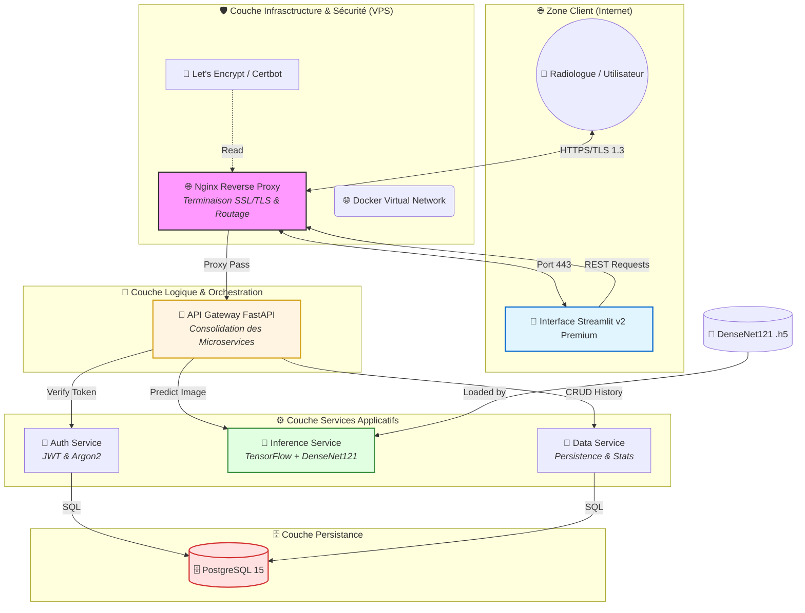

# 🏗️ Architecture Détaillée du Système - Cancer Detection IA

## 1. Vision Holistique
Cette architecture adopte une approche **Microservices Cloud-Native**, privilégiant la séparation des préoccupations (SoC), l'extensibilité et la sécurité des données médicales. Chaque composant est isolé dans un environnement conteneurisé.

## 2. Schéma Architectural de Production
Ce diagramme illustre le flux complet, de l'interaction utilisateur à la persistance des données IA.

---

## 3. Analyse Technique des Couches

### 3.1 Couche d'Exposition (Nginx)
- **Rôle** : Point d'entrée unique.
- **Sécurité** : Gère la terminaison SSL. Aucun microservice n'est directement accessible depuis l'extérieur, protégeant le système contre les scans directs.
- **Performance** : Mise en cache des types MIME et compression `gzip` pour une UI fluide.

### 3.2 Couche d'Orchestration (API Gateway)
- **Pattern Gateway** : Centralise les points de terminaison. Si l'URL d'un microservice change, seul le Gateway est mis à jour.
- **Gestion d'Erreurs** : Intercepte les pannes des sous-services pour renvoyer des réponses standardisées au client.

### 3.3 Moteur d'Inférence (IA)
- **DenseNet121** : Choisi pour sa capacité à réutiliser les caractéristiques (feature reuse), ce qui est idéal pour les textures subtiles des mammographies.
- **Traitement Asynchrone** : Utilise des files d'attente internes pour gérer les prédictions sans bloquer l'interface.

### 3.4 Couche de Données (PostgreSQL)
- **Normalisation** : Schémas relationnels propres pour séparer les utilisateurs des prédictions.
- **Intégrité** : Clés étrangères garantissant qu'une prédiction est toujours rattachée à une image et un timestamp.

---

## 4. Flux de Données Séquentiel (Success Story)
1. **Upload** : Le radiologue envoie une image (.jpg/png) via le Frontend.
2. **Gateway** : Reçoit l'image et l'envoie à l'Inference Service.
3. **IA** : L'image est normalisée (128x128), passée dans le CNN. Le score de confiance est calculé.
4. **Persistence** : Le Gateway envoie le résultat au Data Service qui l'archive en base.
5. **Display** : Le score et la classe (Positive/Negative) sont affichés avec des visualisations Streamlit.

---

**Document Technique de Référence - Niveau Master 2**  
*Ingénierie de l'IA et Architecture Distribuée*

