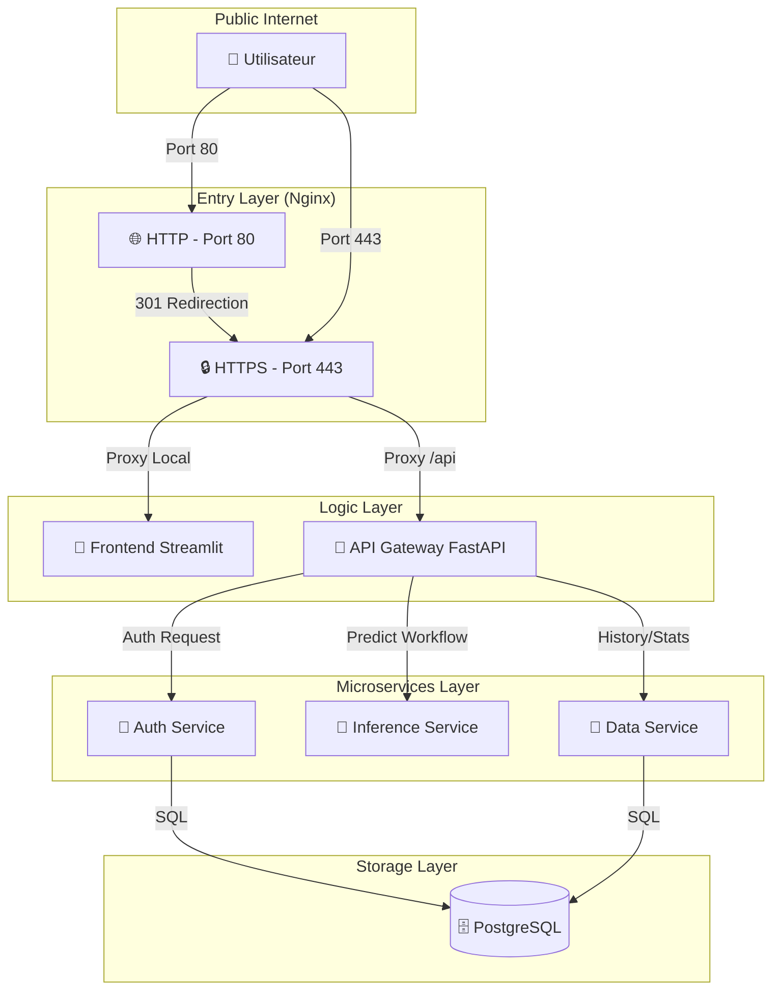

# 🏗️ Architecture du Système de Détection du Cancer du Sein

## 1. Vue d'ensemble
Ce document détaille l'architecture technique du système. La solution repose sur une **architecture microservices** conteneurisée, hautement sécurisée par **SSL/TLS** et orchestrée par **Nginx**.

---

## 2. Architecture Globale
Le système est composé de 7 services interconnectés, gérés par **Docker Compose**.

| Service | Port (Hôte) | Rôle |
|:--- |:--- |:--- |
| **Nginx** | `80`, `443` | Reverse Proxy, SSL Termination & Routage |
| **Frontend** | `8501` (interne) | Interface utilisateur (Streamlit v2 Premium) |
| **API Gateway** | `8004` (interne) | Orchestrateur de requêtes & Consolidation |
| **Auth Service** | `8000` | Gestion de l'identité (JWT & Argon2) |
| **Inference Service**| `8001` | Moteur d'IA (TensorFlow & Keras) |
| **Data Service** | `8002` | Persistance des prédictions (PostgreSQL) |
| **PostgreSQL** | `5432` | Base de données SQL |

### Flux des Communications (HTTPS)

---

## 3. Sécurité et Réseau
Le système a été renforcé pour une mise en production réelle.

### 3.1 Terminaison SSL/TLS
- **Certificats** : Let's Encrypt (Certbot).
- **Protocoles** : TLS v1.2 & v1.3 activés.
- **Redirection automatique** : Tout le trafic HTTP est redirigé vers HTTPS.

### 3.2 Gestion des Uploads
- **Limite Nginx** : Augmentée à **50 Mo** (*client_max_body_size*) pour permettre l'upload d'images mammographiques haute résolution.
- **Timeout** : Configuré à 86400s pour le Frontend pour supporter les sessions Streamlit prolongées.

### 3.3 Communication inter-services
- **API Gateway** : Utilise `httpx` (asynchrone) avec une gestion d'erreurs enrichie pour renvoyer les codes HTTP réels des sous-services au client.
- **Isolation** : Les microservices ne sont plus exposés sur l'internet public ; seul Nginx est accessible.

---

## 4. Composants ML
L'intelligence du système réside dans le `Inference Service`.
- **Modèle** : DenseNet121 optimisé.
- **Mapping Dynamique** : Utilisation de `classes.json` pour garantir l'absence d'inversion des labels (Positive/Negative).

---

**🚀 Documentation Architecture - Version 3.0**
Actualisé : Janvier 2026 | Focus Sécurité & SSL

