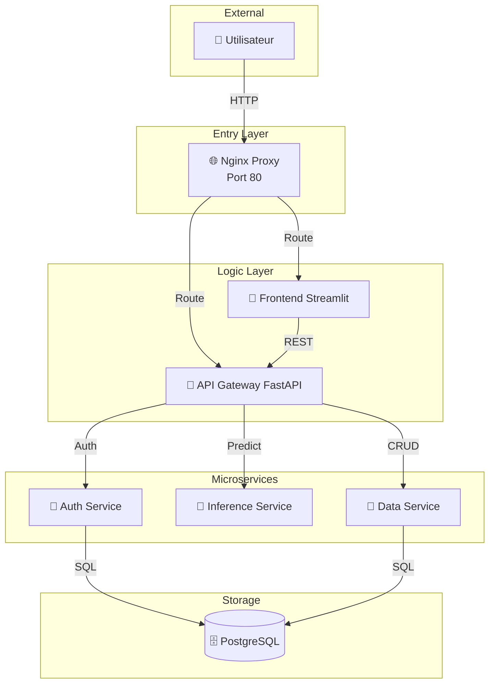
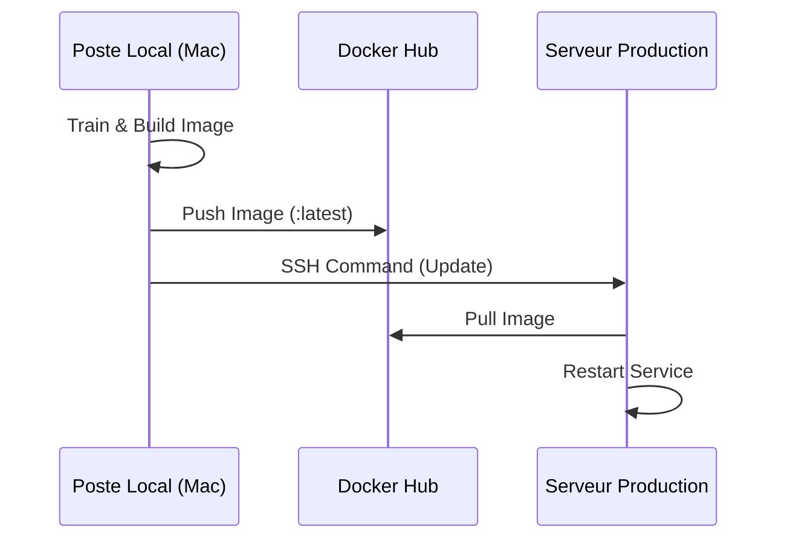

# 🏗️ Architecture du Système de Détection du Cancer du Sein

## 1. Vue d'ensemble
Ce document détaille l'architecture technique du système. La solution repose sur une **architecture microservices** conteneurisée, intégrant un modèle de **Deep Learning (DenseNet121)** pour l'analyse d'images mammographiques.

---

## 2. Architecture Globale
Le système est composé de 7 services interconnectés, gérés par **Docker Compose**.

| Service | Port (Hôte) | Rôle |
|:--- |:--- |:--- |
| **Nginx** | `80` | Reverse Proxy & Point d'entrée unique |
| **Frontend** | `8501` | Interface utilisateur (Streamlit v2) |
| **API Gateway** | `8004` | Orchestrateur de requêtes (FastAPI) |
| **Auth Service** | `8000` | Gestion de l'authentification (JWT & Argon2) |
| **Inference Service**| `8001` | Moteur d'IA (TensorFlow & Keras) |
| **Data Service** | `8002` | Gestion de la persistance (PostgreSQL) |
| **PostgreSQL** | `5432` | Base de données relationnelle |

### Schéma des Flux

---

## 3. Composants ML & Inférence
L'intelligence du système est centralisée dans le `Inference Service`.

### 3.1 Modèle de Deep Learning
- **Architecture** : DenseNet121 (Transfer Learning).
- **Entraînement** : Optimisé pour la classification binaire (Cancer vs Négatif).
- **Prétraitement** : Normalisation (1/255) et redimensionnement (128x128) en temps réel.

### 3.2 Mapping Dynamique des Classes
Pour éviter toute inversion de prédiction, le système utilise un fichier **`classes.json`** :
1. Généré automatiquement par `train.py` lors de l'entraînement.
2. Chargé dynamiquement par `route.py` lors de l'inférence.
3. Garantit une correspondance parfaite entre les sorties numériques du modèle et les labels médicaux.

---

## 4. Pipeline d'Automatisation (CI/CD)
Le projet intègre un pipeline complet via le script **`run_full_pipeline.sh`**.

### Flux CI/CD (Local-to-Cloud)
Plutôt que d'utiliser des outils tiers complexes, le système utilise un pipeline maître direct :
- **Build Local** : Docker construit l'image sur votre machine (Mac).
- **Registry** : L'image est poussée sur **Docker Hub**.
- **Remote Update** : Le VPS est notifié par SSH pour tirer la mise à jour.
4. **Push** : Distribution de l'image sur **Docker Hub** (`mnjaay312/cancer-detection-inference`).
5. **Deploy** : Déploiement automatisé sur le **VPS distant** via SSH.

---

## 5. Sécurité et Performance
- **Authentification** : Utilisation de JWT pour la protection des routes sensibles.
- **Asynchronisme** : Communication inter-services via `httpx` pour des performances optimales.
- **Reverse Proxy** : Nginx assure l'isolation du réseau Docker interne.

---

**🚀 Documentation Architecture - Version 2.5**
Actualisé : Janvier 2026

