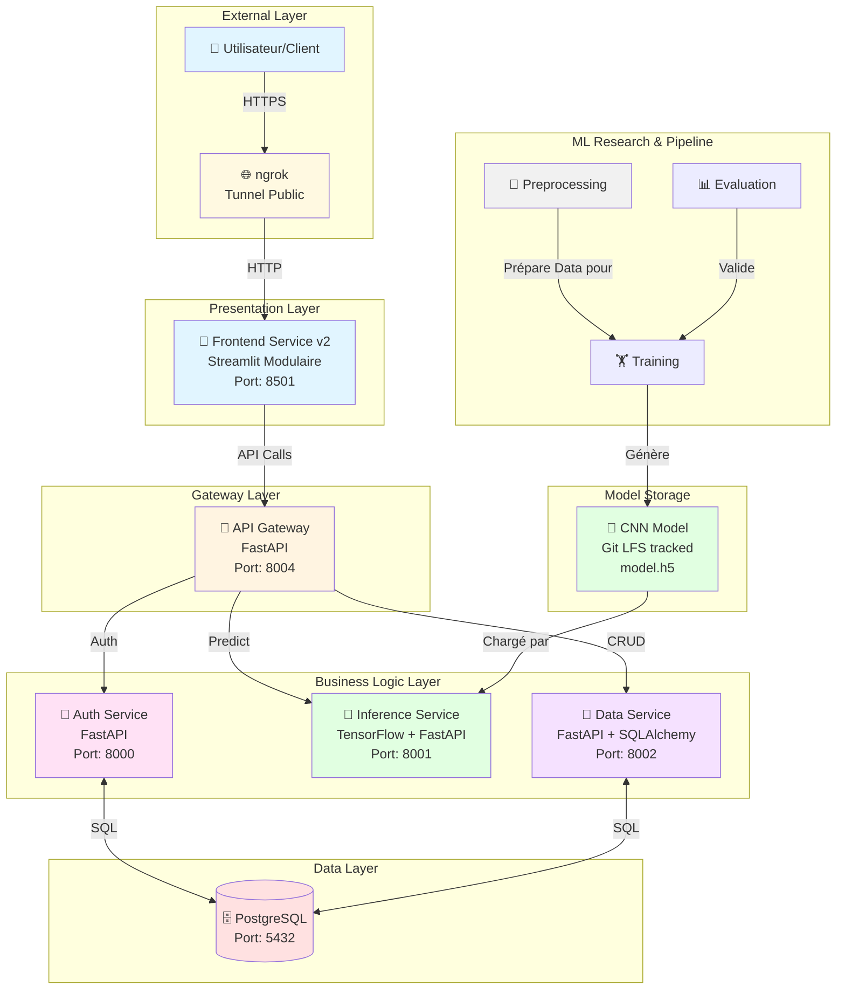

# 🏗️ Architecture du Système

## Vue d'ensemble

Ce document décrit l'architecture complète du système de détection du cancer du sein, basée sur une **architecture microservices** moderne et scalable, couplée à un pipeline de Deep Learning robuste.

---

## Architecture Globale

---

## Services Détaillés

### 🎨 Frontend Service (v2 Modulaire)

**Responsabilité** : Interface utilisateur premium et interactive.

**Structure Modulaire** :
- `components/` : Éléments d'UI isolés (Auth, Stats, Upload, About).
- `config/` : Configuration globale et thèmes (CSS custom).
- `utils/` : Logique métier et appels API.

---

### 🧠 Inference Service

**Responsabilité** : Chargement du modèle et exécution des prédictions.

**Moteur d'IA** :
- **Framework** : TensorFlow 2.15+
- **Input** : Images normalisées (128x128x3).
- **Modèle** : CNN 3-blocs avec Dropout pour éviter l'overfitting.
- **Optimisation** : Chargement "Lazy" du modèle via un singleton.

---

### 🤖 ML Research Layer (`ml/`)

Dossier indépendant pour la recherche et le développement :

1. **`preprocessing.py`** : Script de nettoyage massif (validation, resize, balance).
2. **`train.py`** : Script d'entraînement avec gestion des hyperparamètres via `config.yaml`.
3. **`evaluate.py`** : Evaluation quantitative (Accuracy, Precision, Recall, confusion matrix).
4. **`explore_data.py`** : Visualisation exploratoire du dataset.

---

## Flux de Données ML

### Pipeline de Production
1. **Raw Data** ➔ 2. **Preprocessing** ➔ 3. **Training** ➔ 4. **Export Model** ➔ 5. **Docker Build** ➔ 6. **Production**.

### Flux CI/CD
Lorsqu'un nouveau modèle (`model.h5`) est poussé sur la branche `main` :
- **Source Control** : Git LFS assure le transfert du fichier volumineux.
- **Build Server** : GitHub Actions construit l'image Docker de l'Inference Service.
- **Registry** : L'image est poussée sur Docker Hub.

---

## Sécurité

### Authentification & Autorisation
- **Argon2** : Algorithme de hachage de pointe utilisé pour les mots de passe (plus sûr que BCrypt).
- **JWT** : Tokens signés pour la session utilisateur.
- **Asynchrone** : API Gateway utilise HTTPX pour des appels non-bloquants vers les microservices.

---

## Déploiement

Le système utilise **Docker Compose** pour l'orchestration locale et cloud-ready. La persistence des données est garantie via des **Docker Volumes** synchronisés avec PostgreSQL.

---

**🏗️ Architecture Documentation - Cancer Detection System**
Version 2.0 | Mise à jour : Janvier 2025

