```mermaid
graph TB
    subgraph "Clients"
        U[👤 Utilisateur]
    end

    subgraph "External Gateway"
        G[🚪 Gateway<br/>8004:8000]
    end

    subgraph "Internal Infrastructure (Docker Network)"
        subgraph "UI"
            F[🎨 Frontend<br/>8501]
        end

        subgraph "Microservices"
            A[🔐 Auth<br/>8000]
            I[🧠 Inference<br/>8001]
            D[💾 Data<br/>8002]
        end

        subgraph "Storage"
            DB[(🗄️ PostgreSQL<br/>5432)]
            V[(📁 Volumes)]
        end
    end

    subgraph "ML Assets"
        M[🤖 DenseNet121 Model]
    end

    U -->|Access| F
    F -->|REST Calls| G
    G -->|Verify Auth| A
    G -->|Run Inference| I
    G -->|Get Stats| D
    
    A -->|User Data| DB
    D -->|Predictions| DB
    DB --- V
    I -->|Load| M

    style G fill:#fff4e1,stroke:#d4a017
    style F fill:#e1f5ff,stroke:#0066cc
    style A fill:#ffe1f5,stroke:#c2185b
    style I fill:#e1ffe1,stroke:#388e3c
    style D fill:#f5e1ff,stroke:#7b1fa2
    style DB fill:#ffe1e1,stroke:#d32f2f
```

# 🏗️ Architecture du Système

## Vue d'ensemble

Ce document décrit l'architecture complète du système de détection du cancer du sein, basée sur une **architecture microservices** moderne et scalable, couplée à un pipeline de Deep Learning robuste utilisant **DenseNet121**.

---

## Architecture Globale

Le système est découpé en services orchestrés par Docker Compose. Voici les ports par défaut :

| Service | Port (Hôte) | Port (Docker) | Rôle |
|:--- |:--- |:--- |:--- |
| **Frontend** | `8501` | `8501` | Interface Utilisateur |
| **API Gateway**| `8004` | `8000` | Entrée unique (Workflow routing) |
| **Auth Service**| `8000` | `8000` | Authentification JWT |
| **Inference** | `8001` | `8001` | Inférence Deep Learning |
| **Data Service**| `8002` | `8002` | CRUD & Statistiques SQL |
| **PostgreSQL** | `5432` | `5432` | Base de données |

## Architecture Globale

---

## Services Détaillés

### 🎨 Frontend Service (v2 Modulaire)

**Responsabilité** : Interface utilisateur premium et interactive.

**Structure Modulaire** :
- `components/` : Éléments d'UI isolés (Auth, Stats, Upload, About).
- `config/` : Configuration globale et thèmes (CSS custom).
- `utils/` : Logique métier et appels API.

---

### 🧠 Inference Service

**Responsabilité** : Chargement du modèle et exécution des prédictions.

**Moteur d'IA** :
- **Framework** : TensorFlow 2.15+
- **Input** : Images normalisées (128x128x3).
- **Modèle** : **DenseNet121** (Transfer Learning) avec tête de classification personnalisée.
- **Optimisation** : Chargement "Lazy" du modèle via un singleton.

---

### 🤖 ML Research Layer (`ml/`)

Dossier dédié à l'entraînement et l'optimisation :

1. **`preprocessing.py`** : Préparation des données (Data augmentation, splitting train/val/test).
2. **`model_factory.py`** : Définition de l'architecture DenseNet121.
3. **`train.py`** : Script d'entraînement orchestré par `config.yaml`.
4. **`config.yaml`** : Centralisation des hyperparamètres (LR, Batch size, Epochs).

---

## Flux de Données ML

### Pipeline de Production
1. **Raw Data** ➔ 2. **Preprocessing/Splitting** ➔ 3. **Training (DenseNet)** ➔ 4. **Export Model** ➔ 5. **Docker Build** ➔ 6. **Production**.

### Flux CI/CD
Lorsqu'un nouveau modèle (`model.h5`) est poussé sur la branche `main` :
- **Source Control** : Git LFS assure le transfert du fichier volumineux.
- **Build Server** : GitHub Actions construit l'image Docker de l'Inference Service.
- **Registry** : L'image est poussée sur Docker Hub.

---

## Sécurité

### Authentification & Autorisation
- **Argon2** : Algorithme de hachage de pointe utilisé pour les mots de passe.
- **JWT** : Tokens signés pour la session utilisateur.
- **Asynchrone** : API Gateway utilise HTTPX pour des appels non-bloquants vers les microservices.

---

## Déploiement

Le système utilise **Docker Compose** pour l'orchestration locale et cloud-ready. La persistence des données est garantie via des **Docker Volumes** synchronisés avec PostgreSQL.

---

**🏗️ Architecture Documentation - Cancer Detection System**
Version 2.1 | Mise à jour : Janvier 2026

