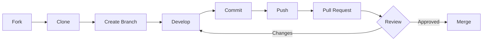

# 🤝 Guide de Contribution

Merci de votre intérêt pour contribuer au projet **Cancer Detection System** ! Ce guide vous aidera à contribuer efficacement.

---

## 📋 Table des Matières

- [Code de Conduite](#code-de-conduite)
- [Comment Contribuer](#comment-contribuer)
- [Configuration de l'Environnement](#configuration-de-lenvironnement)
- [Standards de Code](#standards-de-code)
- [Process de Développement](#process-de-développement)
- [Tests](#tests)
- [Documentation](#documentation)
- [Soumettre une Pull Request](#soumettre-une-pull-request)

---

## Code de Conduite

### Nos Engagements

Dans l'intérêt de favoriser un environnement ouvert et accueillant, nous nous engageons à :

- ✅ Utiliser un langage accueillant et inclusif
- ✅ Respecter les différents points de vue et expériences
- ✅ Accepter gracieusement les critiques constructives
- ✅ Se concentrer sur ce qui est le mieux pour la communauté
- ❌ Ne pas utiliser de langage ou d'images sexualisés
- ❌ Ne pas faire de trolling, commentaires insultants ou attaques personnelles

---

## Comment Contribuer

### Types de Contributions

Nous acceptons plusieurs types de contributions :

#### 🐛 Rapporter des Bugs

Avant de créer un bug report :
1. Vérifiez que le bug n'a pas déjà été reporté
2. Utilisez le template de bug report
3. Incluez le maximum d'informations

**Template de Bug Report :**
```markdown
**Description**
Description claire et concise du bug.

**Reproduction**
Étapes pour reproduire le comportement :
1. Allez à '...'
2. Cliquez sur '...'
3. Faites défiler jusqu'à '...'
4. Voir l'erreur

**Comportement Attendu**
Ce qui devrait se passer.

**Screenshots**
Si applicable, ajoutez des screenshots.

**Environnement**
 - OS: [e.g. macOS 13.0]
 - Docker version: [e.g. 20.10]
 - Python version: [e.g. 3.9]
```

#### 💡 Proposer des Fonctionnalités

**Template de Feature Request :**
```markdown
**Problème à Résoudre**
Description claire du problème.

**Solution Proposée**
Comment vous voyez la fonctionnalité.

**Alternatives Envisagées**
Autres solutions que vous avez considérées.

**Contexte Additionnel**
Tout autre contexte ou screenshot.
```

#### 📝 Améliorer la Documentation

- Corriger des typos
- Clarifier des instructions
- Ajouter des exemples
- Traduire la documentation

#### 🔧 Proposer du Code

Voir la section [Process de Développement](#process-de-développement).

---

## Configuration de l'Environnement

### Prérequis

- **Git**
- **Docker** ≥ 20.10
- **Docker Compose** ≥ 2.0
- **Python** ≥ 3.9 (pour développement local)
- **Un IDE** (VS Code recommandé)

### Installation

1. **Forker le repository**

   Cliquez sur le bouton "Fork" en haut de la page GitHub.

2. **Cloner votre fork**

   ```bash
   git clone https://github.com/VOTRE_USERNAME/DL-CancerDuSein.git
   cd DL-CancerDuSein
   ```

3. **Ajouter le remote upstream**

   ```bash
   git remote add upstream https://github.com/mnjaay/DL-CancerDuSein.git
   ```

4. **Créer un environnement virtuel (optionnel)**

   ```bash
   python -m venv venv
   source venv/bin/activate  # Linux/Mac
   # ou
   venv\Scripts\activate  # Windows
   ```

5. **Lancer les services**

   ```bash
   docker-compose up --build
   ```

---

## Standards de Code

### Python (Backend)

#### Style Guide

Suivez **PEP 8** :
- Indentation : 4 espaces
- Longueur de ligne : 88 caractères (Black)
- Imports : Groupés (stdlib, third-party, local)

**Exemple :**
```python
# Standard library
import os
from datetime import datetime

# Third-party
from fastapi import FastAPI, HTTPException
from sqlalchemy import create_engine

# Local
from .models import User
from .utils import hash_password


def create_user(email: str, password: str) -> User:
    """
    Créer un nouvel utilisateur.
    
    Args:
        email: Adresse email de l'utilisateur
        password: Mot de passe en clair
        
    Returns:
        User: Instance de l'utilisateur créé
        
    Raises:
        ValueError: Si l'email est invalide
    """
    if "@" not in email:
        raise ValueError("Email invalide")
    
    hashed_pwd = hash_password(password)
    user = User(email=email, hashed_password=hashed_pwd)
    return user
```

#### Formatage Automatique

Utilisez **Black** :
```bash
pip install black
black .
```

#### Linting

Utilisez **Flake8** :
```bash
pip install flake8
flake8 .
```

#### Type Hints

Utilisez les type hints partout :
```python
def predict_image(image: Image.Image) -> tuple[str, float]:
    """Retourne (prediction, confidence)."""
    ...
```

### Nommage

- **Fonctions/Variables** : `snake_case`
- **Classes** : `PascalCase`
- **Constantes** : `UPPER_SNAKE_CASE`
- **Fichiers** : `snake_case.py`

**Exemples :**
```python
# Variables et fonctions
user_count = 10
def get_user_by_id(user_id: int):
    ...

# Classes
class UserService:
    ...

# Constantes
MAX_UPLOAD_SIZE = 10_000_000
API_VERSION = "v1"
```

---

## Process de Développement

### Workflow Git



### Étapes Détaillées

1. **Synchroniser avec upstream**

   ```bash
   git checkout main
   git pull upstream main
   ```

2. **Créer une branche**

   Format : `type/description`
   
   Types :
   - `feature/` : Nouvelle fonctionnalité
   - `fix/` : Correction de bug
   - `docs/` : Documentation
   - `refactor/` : Refactoring
   - `test/` : Ajout de tests
   
   ```bash
   git checkout -b feature/add-dicom-support
   ```

3. **Développer**

   Faites vos modifications en respectant les standards.

4. **Tester localement**

   ```bash
   # Lancer tous les services
   docker-compose up --build
   
   # Tester manuellement
   # Ou lancer les tests automatisés (quand disponibles)
   pytest
   ```

5. **Commiter**

   Format de commit : Conventional Commits
   
   ```
   type(scope): description
   
   [body optionnel]
   
   [footer optionnel]
   ```
   
   Types :
   - `feat`: Nouvelle fonctionnalité
   - `fix`: Correction de bug
   - `docs`: Documentation
   - `style`: Formatage
   - `refactor`: Refactoring
   - `test`: Tests
   - `chore`: Tâches de maintenance
   
   **Exemples :**
   ```bash
   git commit -m "feat(inference): add DICOM image support"
   git commit -m "fix(auth): resolve JWT expiration bug"
   git commit -m "docs(api): add endpoint examples"
   ```

6. **Pusher**

   ```bash
   git push origin feature/add-dicom-support
   ```

7. **Créer une Pull Request**

   Voir [Soumettre une Pull Request](#soumettre-une-pull-request).

---

## Tests

### Structure des Tests

```
service-name/
├── app/
│   └── ...
└── tests/
    ├── __init__.py
    ├── conftest.py          # Fixtures pytest
    ├── test_auth.py
    ├── test_inference.py
    └── test_integration.py
```

### Tests Unitaires

Utilisez **pytest** :

```python
# tests/test_auth.py
import pytest
from app.auth_utils import hash_password, verify_password


def test_hash_password():
    """Test le hachage de mot de passe."""
    password = "TestPassword123"
    hashed = hash_password(password)
    
    assert hashed != password
    assert len(hashed) > 0


def test_verify_password():
    """Test la vérification de mot de passe."""
    password = "TestPassword123"
    hashed = hash_password(password)
    
    assert verify_password(password, hashed) is True
    assert verify_password("WrongPassword", hashed) is False
```

### Tests d'Intégration

```python
# tests/test_integration.py
import pytest
from fastapi.testclient import TestClient
from app.main import app


client = TestClient(app)


def test_register_and_login():
    """Test le flow complet inscription + connexion."""
    # Inscription
    register_response = client.post(
        "/auth/register",
        json={"email": "test@example.com", "password": "test123"}
    )
    assert register_response.status_code == 200
    
    # Connexion
    login_response = client.post(
        "/auth/login",
        json={"email": "test@example.com", "password": "test123"}
    )
    assert login_response.status_code == 200
    assert "access_token" in login_response.json()
```

### Lancer les Tests

```bash
# Installer pytest
pip install pytest pytest-cov

# Lancer tous les tests
pytest

# Avec coverage
pytest --cov=app tests/

# Tests spécifiques
pytest tests/test_auth.py
```

---

## Documentation

### Docstrings

Suivez le format **Google Style** :

```python
def predict_image(image: Image.Image, model: tf.keras.Model) -> dict:
    """
    Prédit si une image contient du cancer.
    
    Cette fonction prétraite l'image, effectue la prédiction avec le modèle CNN,
    et retourne le résultat avec le score de confiance.
    
    Args:
        image: Image PIL à analyser
        model: Modèle TensorFlow chargé
        
    Returns:
        Un dictionnaire contenant :
            - prediction (str): "Positive" ou "Negative"
            - confidence (float): Score de confiance entre 0 et 1
            
    Raises:
        ValueError: Si l'image est invalide ou corrompue
        
    Example:
        >>> from PIL import Image
        >>> img = Image.open("mammogram.jpg")
        >>> result = predict_image(img, cnn_model)
        >>> print(result)
        {'prediction': 'Negative', 'confidence': 0.87}
    """
    ...
```

### README

Pour chaque nouveau service ou module majeur, ajoutez un README.

---

## Soumettre une Pull Request

### Template de PR

```markdown
## Description
Description claire de ce que fait cette PR.

## Type de Changement
- [ ] Bug fix (non-breaking change)
- [ ] Nouvelle fonctionnalité (non-breaking change)
- [ ] Breaking change
- [ ] Documentation

## Comment Tester
Étapes pour tester vos changements :
1. ...
2. ...

## Checklist
- [ ] Mon code suit le style du projet
- [ ] J'ai effectué une auto-review
- [ ] J'ai commenté le code difficile
- [ ] J'ai mis à jour la documentation
- [ ] Mes changements ne génèrent pas de warnings
- [ ] J'ai ajouté des tests
- [ ] Les tests passent localement
- [ ] J'ai mis à jour le CHANGELOG (si applicable)

## Screenshots (si applicable)
```

### Revue de Code

Votre PR sera revue par un maintainer. Attendez-vous à :

- Des questions de clarification
- Des suggestions d'amélioration
- Des demandes de modifications

**Répondez aux commentaires** et faites les modifications demandées.

### Après l'Approbation

Une fois approuvée, votre PR sera mergée par un maintainer.

---

## Workflow Avancé

### Rebasing

Si votre branche est en retard sur `main` :

```bash
git checkout main
git pull upstream main
git checkout feature/votre-feature
git rebase main
```

En cas de conflit :

```bash
# Résoudre les conflits
git add .
git rebase --continue
```

### Squashing des Commits

Pour garder l'historique propre :

```bash
git rebase -i HEAD~3  # 3 derniers commits
# Choisir 'squash' pour les commits à fusionner
```

---

## Ressources

### Documentation Externe

- [FastAPI Documentation](https://fastapi.tiangolo.com/)
- [SQLAlchemy Documentation](https://docs.sqlalchemy.org/)
- [TensorFlow Guide](https://www.tensorflow.org/guide)
- [Docker Best Practices](https://docs.docker.com/develop/dev-best-practices/)

### Outils Recommandés

- **IDE** : VS Code, PyCharm
- **Extensions VS Code** :
  - Python
  - Pylance
  - Docker
  - GitLens
  - Black Formatter
  
### Communication

- **GitHub Issues** : Pour bugs et features
- **GitHub Discussions** : Pour questions et discussions
- **Email** : contact@example.com (pour questions privées)

---

## Questions ?

Si vous avez des questions :

1. Consultez d'abord la [documentation](./README.md)
2. Cherchez dans les [Issues](https://github.com/mnjaay/DL-CancerDuSein/issues)
3. Créez une nouvelle issue ou discussion

---

## Remerciements

Merci à tous les contributeurs qui rendent ce projet possible ! 🙏

Chaque contribution, petite ou grande, est appréciée.

---

<div align="center">

**🤝 Merci de contribuer au Cancer Detection System !**

Ensemble, rendons la détection du cancer plus accessible.

</div>
