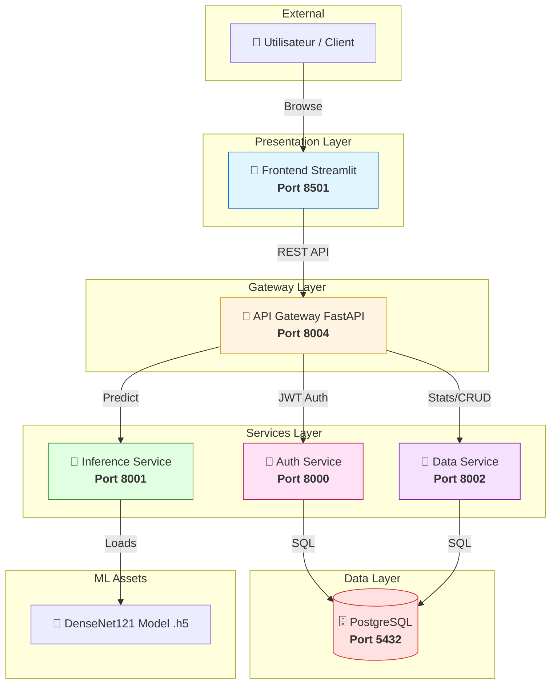

# 🏥 Système de Détection du Cancer du Sein par IA

<div align="center">


**Solution professionnelle de détection précoce du cancer du sein via Deep Learning (DenseNet121) et architecture Microservices.**

[Démarrage Rapide](#-démarrage-rapide) • [Documentation ML](#-pipeline-machine-learning) • [Architecture](#-architecture) • [Déploiement](#-déploiement-et-automatisation)

</div>

---

## 📋 Table des Matières

- [Vue d'ensemble](#-vue-densemble)
- [Architecture du Système](#-architecture-du-système)
- [Pipeline Machine Learning](#-pipeline-machine-learning)
- [Installation et Configuration](#-installation-et-configuration)
- [Démarrage Rapide](#-démarrage-rapide)
- [Déploiement et Automatisation](#-déploiement-et-automatisation)
- [Structure du Projet](#-structure-du-projet)
- [Avertissement Médical](#-avertissement-médical)

---

## 🎯 Vue d'ensemble

Ce projet est un système complet de grade industriel pour l'analyse d'images mammographiques. Il combine la puissance de **DenseNet121** avec une infrastructure **microservices modulaire** pour garantir scalabilité, performance et maintenabilité.

### 🌟 Points Forts
- 🧠 **IA de Pointe** : Modèle **DenseNet121** (Transfer Learning) avec **mapping de classes dynamique**.
- 🏗️ **Architecture Moderne** : Microservices FastAPI synchronisés via une API Gateway et filtrés par **Nginx**.
- 🎨 **Interface Premium** : Frontend Streamlit v2 modulaire avec design system moderne.
- 🔄 **Pipeline Cloud-Ready** : Automatisation complète incluant le déploiement SSH sur VPS.
- 💾 **Versioning Modèle** : Suivi des fichiers lourds (.h5) via Git LFS et Docker Hub.

---

## 🏗️ Architecture du Système

Le système est découpé en services spécialisés communiquant via une API Gateway :

| Service | Port Externe | Port Interne | Rôle |
|:--- |:--- |:--- |:--- |
| **Frontend** | `8501` | `8501` | Interface Utilisateur (Streamlit) |
| **API Gateway** | `8004` | `8000` | Port d'entrée unique (FastAPI) |
| **Auth Service** | `8000` | `8000` | Authentification JWT |
| **Inference Service**| `8001` | `8001` | Prédictions ML (TensorFlow) |
| **Data Service** | `8002` | `8002` | Gestion Base de Données |
| **PostgreSQL** | `5432` | `5432` | Persistence des données |

### Schéma des Communications



---

## 🤖 Pipeline Machine Learning

Le dossier `ml/` contient un pipeline de données optimisé, aligné sur les standards de recherche actuels.

### 🧹 1. Preprocessing & Splitting
Utilisez `ml/preprocessing.py` pour préparer vos données :
- ✅ Normalisation et redimensionnement (128x128 RGB).
- ✅ **Nouveau** : Détection automatique des dossiers prêts (`train/val/test`) ou splitting depuis un dossier `raw`.
- ✅ Data Augmentation avancée intégrée (Rotation, Zoom, Flips).

### 🏋️ 2. Entraînement (Transfer Learning)
Le script `ml/train.py` orchestré par `ml/config.yaml` utilise :
- Architecture **DenseNet121** pré-entraînée.
- Optimiseur **Adam** avec réduction dynamique du learning rate.
- Callbacks intelligents (EarlyStopping) pour éviter l'overfitting.

---

## 🚀 Démarrage Rapide

### 🧱 Option A : Tout-en-un (Recommandé)
Nous avons créé un script qui gère tout le cycle de vie :
```bash
chmod +x run_full_pipeline.sh
./run_full_pipeline.sh
```
*Ce script : installe l'environnement, vérifie les données, entraîne le modèle, génère le mapping des classes, construit l'image Docker, la pousse sur le Hub et **met à jour automatiquement votre VPS via SSH**.*

### 🐳 Option B : Lancement Docker uniquement
Si vous avez déjà un modèle prêt dans `inference-service/models/` :
```bash
docker-compose up -d --build
```

---

## ⚙️ Installation et Configuration

### Prérequis
- Docker Desktop & Docker Compose
- Python 3.11+
- Git LFS (`brew install git-lfs` ou `apt install git-lfs`)

### Variables d'Environnement
Chaque service possède son propre fichier `.env`. Les valeurs par défaut sont configurées pour Docker Compose.

---

### ☁️ Déploiement Cloud (VPS)
Le déploiement est piloté depuis votre machine locale. Une fois le push Docker Hub terminé, le script automatise la mise à jour sur le serveur distant :
1. Connexion SSH sécurisée.
2. `docker compose pull` pour récupérer l'image fraîche.
3. `docker compose up -d` pour redémarrer l'IA avec le nouveau modèle.

---

## 🔄 Déploiement et Automatisation

### Git LFS (Large File Storage)
Les modèles ML (.h5) sont stockés via LFS pour garantir la légèreté du repository.

### GitHub Actions
Le workflow `.github/workflows/model-update.yml` automatise la reconstruction des images Docker dès qu'un nouveau modèle est détecté sur `main`.

---

## 📁 Structure du Projet

```text
DL-CancerDuSein/
├── 📂 api-gateway/         # Passerelle unique (FastAPI)
├── 📂 auth-service/        # Gestion utilisateurs (FastAPI)
├── 📂 data-service/        # CRUD & Statistiques (FastAPI)
├── 📂 inference-service/   # Moteur IA (TensorFlow + DenseNet)
├── 📂 frontend/            # Interface utilisateur (Streamlit v2)
├── 📂 ml/                  # Research & Training Pipeline
│   ├── train.py            # Script d'entraînement orchestré
│   ├── preprocessing.py    # Préparation & Splitting intelligent
│   ├── model_factory.py    # Définition de l'architecture DenseNet121
│   └── config.yaml         # Paramètres d'entraînement
├── run_full_pipeline.sh    # Script maître d'automatisation (Master)
├── setup_ml.sh             # Installation environnement local ML
└── docker-compose.yml      # Orchestration Microservices
```

---

## ⚠️ Avertissement Médical

> **IMPORTANT**: Ce système est conçu à des fins de **recherche et d'éducation**. Il ne remplace pas un avis médical professionnel. Les résultats doivent être validés par un radiologue ou un oncologue diplômé. Le diagnostic final appartient exclusivement au personnel soignant qualifié.

---

<div align="center">

Made with ❤️ by the Cancer Detection Team
© 2026 - Tous droits réservés

</div>
