# 🏥 Système de Détection du Cancer du Sein par IA

<div align="center">


**Solution professionnelle de détection précoce du cancer du sein via Deep Learning et architecture Microservices.**

[Démarrage Rapide](#-démarrage-rapide) • [Documentation ML](#-pipeline-machine-learning) • [Architecture](#-architecture) • [Déploiement](#-déploiement-et-automatisation)

</div>

---

## 📋 Table des Matières

- [Vue d'ensemble](#-vue-densemble)
- [Architecture du Système](#-architecture-du-système)
- [Pipeline Machine Learning](#-pipeline-machine-learning)
- [Installation et Configuration](#-installation-et-configuration)
- [Démarrage Rapide](#-démarrage-rapide)
- [Déploiement et Automatisation](#-déploiement-et-automatisation)
- [Structure du Projet](#-structure-du-projet)
- [Avertissement Médical](#-avertissement-médical)

---

## 🎯 Vue d'ensemble

Ce projet est un système complet de grade industriel pour l'analyse d'images mammographiques. Il combine la puissance des **CNN (Convolutional Neural Networks)** avec une infrastructure **microservices modulaire** pour garantir scalabilité, performance et maintenabilité.

### 🌟 Points Forts
- 🧠 **IA de Pointe** : Modèle CNN optimisé avec Data Augmentation.
- 🏗️ **Architecture Moderne** : Microservices FastAPI synchronisés via une API Gateway.
- 🎨 **Interface Premium** : Frontend Streamlit v2 modulaire avec design system moderne.
- 🔄 **CI/CD Robuste** : Automatisation complète via GitHub Actions et Docker Hub.
- 💾 **Versioning Modèle** : Suivi des fichiers lourds (.h5) via Git LFS.

---

## 🏗️ Architecture du Système

Le système est découpé en services spécialisés communiquant en asynchrone :

| Service | Technologies | Rôle |
|:--- |:--- |:--- |
| **API Gateway** | FastAPI, HTTPX | Point d'entrée unique, routage et aggrégation de workflow. |
| **Auth Service** | FastAPI, JWT, Argon2 | Gestion sécurisée des utilisateurs et authentification. |
| **Inference Service** | FastAPI, TensorFlow | Moteur de prédiction chargeant le modèle CNN. |
| **Data Service** | FastAPI, SQLAlchemy | Persistence des résultats et statistiques dans PostgreSQL. |
| **Frontend v2** | Streamlit, Plotly | Interface utilisateur modulaire et interactive. |
| **Database** | PostgreSQL 15 | Stockage relationnel des données cliniques. |

### Schéma des Communications

```mermaid
graph TB
    subgraph "External"
        U[👤 Utilisateur / Client]
    end
    
    subgraph "Presentation Layer"
        F[🎨 Frontend Streamlit<br/><b>Port 8501</b>]
    end
    
    subgraph "Gateway Layer"
        G[🚪 API Gateway FastAPI<br/><b>Port 8004</b>]
    end
    
    subgraph "Services Layer"
        A[🔐 Auth Service<br/><b>Port 8000</b>]
        I[🧠 Inference Service<br/><b>Port 8001</b>]
        D[💾 Data Service<br/><b>Port 8002</b>]
    end
    
    subgraph "Data Layer"
        DB[(🗄️ PostgreSQL<br/><b>Port 5432</b>)]
    end
    
    subgraph "ML Assets"
        M[🤖 CNN Model .h5]
    end

    U -->|Browse| F
    F -->|REST API| G
    G -->|JWT Auth| A
    G -->|Predict| I
    G -->|Stats/CRUD| D
    A -->|SQL| DB
    D -->|SQL| DB
    I -->|Loads| M

    style F fill:#e1f5ff,stroke:#0066cc
    style G fill:#fff4e1,stroke:#d4a017
    style A fill:#ffe1f5,stroke:#c2185b
    style I fill:#e1ffe1,stroke:#388e3c
    style D fill:#f5e1ff,stroke:#7b1fa2
    style DB fill:#ffe1e1,stroke:#d32f2f
```



---

## 🤖 Pipeline Machine Learning

Le dossier `ml/` contient un pipeline de données complet, détaché des conteneurs pour permettre l'entraînement local fluide.

### 🧹 1. Preprocessing & Nettoyage
Utilisez `ml/preprocessing.py` pour préparer vos données brutes :
- ✅ Validation d'images (format, corruption, taille).
- ✅ Normalisation et redimensionnement (128x128 RGB).
- ✅ Équilibrage automatique des classes (Undersampling/Oversampling).

### 🏋️ 2. Entraînement
Le script `ml/train.py` implémente :
- Architecture CNN 3-blocs robuste.
- Callbacks avancés (EarlyStopping, ModelCheckpoint, ReduceLROnPlateau).
- Monitoring en temps réel via TensorBoard.

### 📊 3. Évaluation
`ml/evaluate.py` génère des rapports complets :
- Matrice de confusion, Courbes ROC et Precision-Recall.
- Exportation des métriques au format JSON pour le suivi de version.

---

## 🚀 Démarrage Rapide

### 🧱 Option A : Tout-en-un (Recommandé)
Nous avons créé un script qui gère tout le cycle de vie :
```bash
chmod +x run_full_pipeline.sh
./run_full_pipeline.sh
```
*Ce script : installe l'environnement, nettoie les données, entraîne le modèle et met à jour Docker.*

### 🐳 Option B : Lancement Docker uniquement
Si vous avez déjà un modèle prêt :
```bash
docker-compose up -d --build
```

---

## ⚙️ Installation et Configuration

### Prérequis
- Docker Desktop & Docker Compose
- Python 3.11+
- Git LFS (`brew install git-lfs` ou `apt install git-lfs`)

### Variables d'Environnement
Chaque service possède son propre fichier `.env`. Les valeurs par défaut sont configurées pour Docker Compose. **En production, changez impérativement la `SECRET_KEY` de l'Auth Service.**

---

## 🔄 Déploiement et Automatisation

### Git LFS (Large File Storage)
Les modèles ML (.h5) ne sont pas stockés directement dans Git mais via LFS pour éviter de ralentir le repository.
```bash
git lfs install
git lfs track "*.h5"
```

### GitHub Actions
Le workflow `.github/workflows/model-update.yml` automatise le déploiement :
1. Détection du nouveau modèle lors d'un `push`.
2. Build automatique des images Docker.
3. Push vers Docker Hub.

---

## 📁 Structure du Projet

```text
DL-CancerDuSein/
├── 📂 api-gateway/         # Passerelle unique (FastAPI)
│   ├── main.py             # Routage & Workflows
│   └── dockerfile
├── 📂 auth-service/        # Gestion utilisateurs (FastAPI)
│   ├── app/                # Logique Auth & JWT (Argon2)
│   └── dockerfile
├── 📂 data-service/        # CRUD & Statistiques (FastAPI)
│   ├── app/                # Modèles & Routes SQL (PostgreSQL)
│   └── dockerfile
├── 📂 inference-service/   # Moteur IA (TensorFlow)
│   ├── app/                # Chargement modèle & Prédiction
│   ├── models/             # Dossier du modèle .h5 (Git LFS)
│   └── dockerfile
├── 📂 frontend/            # Interface utilisateur (Streamlit v2)
│   ├── 📂 components/      # UI isolée (Auth, Stats, Upload, About)
│   ├── 📂 config/          # Thèmes & CSS personalisés
│   ├── 📂 utils/           # Client API & Logique métier
│   ├── streamlit_app.py    # Point d'entrée application
│   └── dockerfile
├── 📂 ml/                  # Research & Training Pipeline
│   ├── train.py            # Script d'entraînement CNN
│   ├── preprocessing.py    # Nettoyage & Augmentation Data
│   ├── evaluate.py         # Métriques, Confusion Matrix & Plots
│   └── config.yaml         # Configuration des hyperparamètres
├── run_full_pipeline.sh    # Script maître d'automatisation (Master)
├── setup_ml.sh             # Installation environnement local ML
└── docker-compose.yml      # Orchestration Microservices Cloud-ready
```

---

## ⚠️ Avertissement Médical

> **IMPORTANT**: Ce système est conçu à des fins de **recherche et d'éducation**. Il ne remplace pas un avis médical professionnel. Les résultats doivent être validés par un radiologue ou un oncologue diplômé. Le diagnostic final appartient exclusivement au personnel soignant qualifié.

---

<div align="center">

Made with ❤️ by the Cancer Detection Team
© 2025 - Tous droits réservés

</div>
